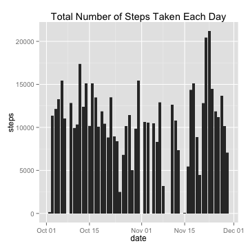
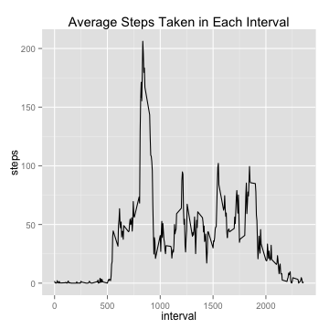
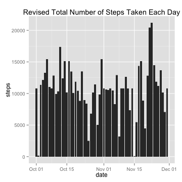

# Reproducible Research: Peer Assessment 1

## Loading libraries


```r
library(ggplot2)
```

## Loading and preprocessing the data


```r
data <- read.csv("activity.csv", colClasses = c(date = "Date"))
```

## What is mean total number of steps taken per day?


```r
qplot(date, steps, geom = "histogram", 
      data = data, stat = "identity",
      main = "Total Number of Steps Taken Each Day")
```

```
## Warning: Removed 2304 rows containing missing values (position_stack).
```

 

### Mean and Median number of total steps per day


```r
total <- tapply(data$steps, data$date, sum)
mean(total, na.rm = TRUE)
```

```
## [1] 10766
```

```r
median(total, na.rm = TRUE)
```

```
## [1] 10765
```

## What is the average daily activity pattern?


```r
intData <- aggregate(steps ~ interval, data, FUN = mean)
```


```r
qplot(interval, steps, data = intData, 
                       geom = "line",
                       main = "Average Steps Taken in Each Interval")
```

 

### Which 5-minute interval contains the maximum number of steps?


```r
intData[order(-intData$steps),][1,1]
```

```
## [1] 835
```

## Imputing missing values

### Total number of rows with NAs?


```r
nrow(data) - nrow(data[complete.cases(data),])
```

```
## [1] 2304
```

### Missing data filled in


```r
data2 <- data
data2$steps <- sapply(1:nrow(data2), function(x) {
        if (is.na(data2[x,1])) {
                intData[intData$interval == data2[x,3],2]
        } else {
                data2[x,1]
        }
    }
)                      
     
#Compare:
head(data)
```

```
##   steps       date interval
## 1    NA 2012-10-01        0
## 2    NA 2012-10-01        5
## 3    NA 2012-10-01       10
## 4    NA 2012-10-01       15
## 5    NA 2012-10-01       20
## 6    NA 2012-10-01       25
```

```r
head(data2)
```

```
##     steps       date interval
## 1 1.71698 2012-10-01        0
## 2 0.33962 2012-10-01        5
## 3 0.13208 2012-10-01       10
## 4 0.15094 2012-10-01       15
## 5 0.07547 2012-10-01       20
## 6 2.09434 2012-10-01       25
```

### Histogram, mean, and median of filled dataset


```r
qplot(date, steps, geom = "histogram", 
      data = data2, stat = "identity",
      main = "Revised Total Number of Steps Taken Each Day")
```

 


```r
total2 <- tapply(data2$steps, data2$date, sum)
mean(total2)
```

```
## [1] 10766
```

```r
median(total2)
```

```
## [1] 10766
```


### Is there an impact of imputing missing data?

## Are there differences in activity patterns between weekdays and weekends?
